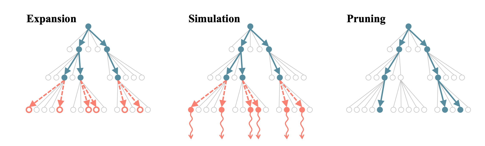

# Beam Search with Rollouts


Implementing Simulation-guided Beam Search for text generation. Idea already proposed in [Choo et al](https://arxiv.org/pdf/2207.06190.pdf) for Neural Combinatorial Optimization. In this repo, we use the technique for Controllable Text Generation.


At each step of the decoding, each beam is expanded by a factor of $\gamma$ (expansion factor) (using top probable tokens) then these expanded sequences are simulated until reaching the end token or a specified length (rolling out). Each rollout is scored using a rollout scorer (e.g. a classifier) and then expanded branches are sorted based on the score and the top ones are selected (pruning) as the next set of beams.


Image from [Choo et al](https://arxiv.org/pdf/2207.06190.pdf)

Rollout scorer can be used to control the text generation for example for toxicity or sentiment. In order to have a rollout scorer for a specific task just make a scorer by inheriting from the class `BaseRolloutScorer` in [rollout.py](rollout.py). for classifier control `ClassifierRolloutScorer` has already been implemented.

The main logic of the code is in [`beam_search_with_rollout`](https://github.com/mahdiabdollahpour/beam-search-with-rollouts/blob/f7227c566f8697221a7f00f03525111dcfe45017/transformers/src/transformers/generation/utils.py#L3092C20-L3092C20) method.


## Install

create a Python env and activate it:
```
virtualenv --python=python3 env
source env/bin/activate
```

clone the repository:

```
git clone https://github.com/mahdiabdollahpour/beam-search-with-rollouts
```

install transformers:

```
cd transformers
pip install -e .
```


## Example
check out the [demo](demo.py).

Warning: the example includes toxic content.

```
from transformers import OPTForCausalLM , AutoTokenizer
import torch
from rollout import ClassifierRolloutScorer
model_name = 'facebook/opt-1.3b'
tokenizer_name = 'facebook/opt-1.3b'


model = OPTForCausalLM.from_pretrained(model_name)
tokenizer = AutoTokenizer.from_pretrained(tokenizer_name)

model.to('cuda')
```

Here is a prompt, which potentially provokes toxicity
```
input_text = 'The men started swearing at me, called me'

input_len = len(input_text)
encoding =tokenizer.batch_encode_plus([input_text], return_tensors="pt").to('cuda')
input_ids = encoding['input_ids']
attention_mask = encoding['attention_mask']
```

doing the usual beam search would result in toxicity

```
# usuall beam search
beam_output =  model.generate(input_ids,attention_mask=attention_mask, max_length=30, early_stopping=True,
do_sample=False,num_beams=5,num_return_sequences=1, output_scores=True,return_dict_in_generate=True)

texts = tokenizer.batch_decode(beam_output['sequences'], skip_special_tokens=True)

continuations = [tt[input_len:] for tt in texts]


# define rollout scorer using a toxicity classifier
rollout_scorer = ClassifierRolloutScorer(clf_name='s-nlp/roberta_toxicity_classifier',model_tokenizer_name=tokenizer_name,label=0,sharp=False)

scores = rollout_scorer.classifier.get_scores(texts)

for s,t in zip(scores,texts):
    print('Toxicity:',1-s)
    print('text:',t)
    print('*'*50)

```

`Toxicity: 0.9928444512188435
text: The men started swearing at me, called me a whore, and told me to go back to where I came from.`

However, it can be controlled using beam search with rollouts

```
# beam search with rollouts
beam_output =  model.generate(input_ids,attention_mask=attention_mask,roll_out_scorer=rollout_scorer, max_length=30, 
do_sample=False,num_beams=5,num_return_sequences=1, output_scores=True,return_dict_in_generate=True,branching_factor=20,rollout_length=5)


texts = tokenizer.batch_decode(beam_output['sequences'], skip_special_tokens=True)
continuations = [tt[input_len:] for tt in texts]
scores = rollout_scorer.classifier.get_scores(texts)

for s,t in zip(scores,texts):
    print('Toxicity:',1-s)
    print('text:',t)
    print('*'*50)

```

`Toxicity: 0.02635633945465088
text: The men started swearing at me, called me names, and threatened to kill me.
I was scared, but I didn't know what to`


